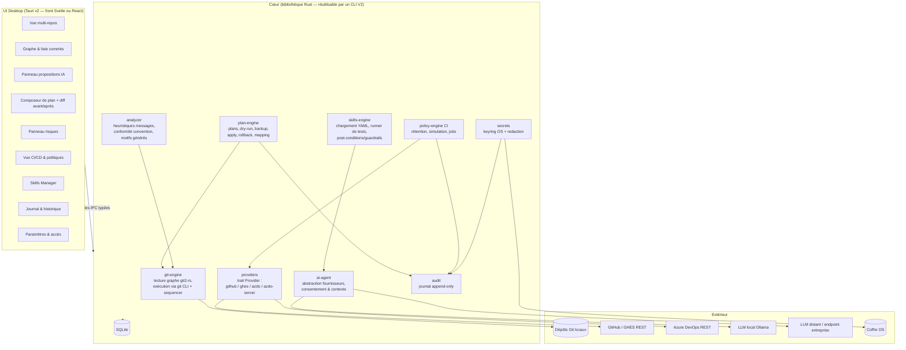

# 5. Architecture cible

Choix **[Recommandé]** ; les faits sur les stacks sont **[Vérifié]** le 2026-07-24 (sources en fin de [08-apis-plateformes.md](08-apis-plateformes.md) et rapports d'étude).

## 5.1 Vue d'ensemble

## 5.2 Choix de stack desktop

| Option | Faits vérifiés (2026-07-24) | Avantages | Limites |
|---|---|---|---|
| **Tauri v2** ✅ retenu | GA depuis le 02/10/2024, crate 2.11.5 (07/2026) ; rendu via la WebView **système** (WebView2/Chromium sous Windows, WKWebView sous macOS, WebKitGTK sous Linux) ; binaire minimal annoncé ~600 KB | Empreinte faible ; cœur **Rust** = même langage que git2-rs/keyring, sûreté mémoire ; modèle de permissions/IPC strict ; précédent probant : GitButler est bâti sur Tauri | Compétence Rust requise ; hétérogénéité des WebViews système à tester (surtout WebKitGTK) |
| Electron | Embarque Chromium + Node.js dans chaque app ; runtime v43.2.0 ≈ 118-138 Mo zippé | Écosystème JS énorme, rendu identique partout | Poids, surface d'attaque Node dans le processus principal, tout le cœur Git/sécurité serait en JS/N-API |
| .NET MAUI | **Pas de support Linux desktop officiel** (backend GTK4 *expérimental* apparu dans `dotnet/maui-labs` le 13/07/2026) | Confort C# pour une équipe .NET | Linux exclu du support officiel → rédhibitoire si cible 3 OS |
| Avalonia UI | MIT ; cross-platform incluant Linux | **Alternative crédible si l'équipe est .NET** : Avalonia + LibGit2Sharp (0.32.0, maintenu) + `Meziantou...CredentialManager`/DPAPI | UI XAML non web ; moins de précédents dans cette catégorie d'outils ; DPAPI = Windows seulement (coffres à traiter par OS) |

**Décision proposée** : **Tauri v2 + cœur Rust** (ADR-001). Critère de bascule explicite : si l'équipe de réalisation est majoritairement .NET sans appétence Rust, prendre **Avalonia + LibGit2Sharp** — l'architecture logique (modules, plans, garde-fous) reste identique.

## 5.3 Décisions d'architecture (ADR résumés)

| ADR | Décision | Justification | Alternatives rejetées |
|---|---|---|---|
| 001 | Tauri v2 + Rust | cf. §5.2 | Electron (poids/surface), MAUI (Linux), web pur (accès Git/coffre local impossible) |
| 002 | **Exécution Git hybride** : lecture/analyse via `git2-rs` ; réécritures via le binaire `git` (sequencer `rebase -i` piloté par `GIT_SEQUENCE_EDITOR` + todo list générée) ; réécritures massives V2 sur le modèle filter-repo | Le sequencer natif est le moteur le plus éprouvé du monde pour squash/reword/reorder/drop ; `GIT_SEQUENCE_EDITOR` est documenté pour ce pilotage [Vérifié git-scm.com] ; libgit2 est excellent en lecture mais son rebase ne couvre pas tous les cas du sequencer | Tout-libgit2 (rebase incomplet), réimplémentation maison (risque inacceptable) |
| 003 | SQLite local unique | Modèle [06-modele-donnees.md](06-modele-donnees.md) ; zéro serveur ; reconstructible | Fichiers JSON épars (requêtes/intégrité pauvres) |
| 004 | Skills **déclaratives** (YAML + prompts + tests), pas de code tiers exécutable au MVP | Surface d'attaque maîtrisée ; gouvernance simple ; versionnable | Plugins code (sandboxing complexe → V3) |
| 005 | Secrets via crate `keyring` (coffres OS natifs) ; plugin Tauri Store proscrit pour les secrets (non chiffré) ; Stronghold non retenu (moteur upstream à la fraîcheur incertaine) | [07-securite-tokens.md](07-securite-tokens.md) | Fichier chiffré maison par défaut (réinventer un coffre) |
| 006 | Abstraction fournisseur IA : trait unique, backends **Ollama local** (API HTTP `127.0.0.1:11434` [Vérifié]), **endpoint compatible OpenAI** (passerelles d'entreprise), **Anthropic** ; consentement + aperçu avant tout envoi distant | Couvre les modes local/entreprise exigés ; interchangeable | Fournisseur unique câblé |
| 007 | Dry-run par **construction réelle** dans `refs/mc/preview/*`, application par bascule atomique de réf après backup | Aperçu exact, application quasi instantanée, rollback trivial ([06](06-modele-donnees.md) §6.5) | Simulation « sur le papier » (écarts possibles), application in-place (état intermédiaire en cas de crash) |

## 5.4 Modules du cœur — responsabilités et frontières

| Module | Responsabilités | Ne fait jamais |
|---|---|---|
| `git-engine` | Graphe, diffs, refs, merge-base, détection commits signés/partagés ; exécution contrôlée du binaire git (env épuré, chemins validés) | Réseau, IA |
| `analyzer` | Heuristiques messages faibles (longueur, vocabulaire vide, doublons, gros diff sans corps), conformité convention, motifs de mentions générées (configurables/dépôt) | Modifier quoi que ce soit |
| `plan-engine` | Cycle de vie des plans, empreintes, dry-run, backup, apply, rollback, mapping, invariants (reword ⇒ arbres identiques) | Appliquer sans dry-run/backup ; toucher une branche protégée |
| `skills-engine` | Chargement/validation YAML (JSON Schema), registre, runner de tests, **vérification programmatique des guardrails sur les sorties IA** | Exécuter du code de skill |
| `ai-agent` | Assemblage du contexte (jamais de secrets), appels fournisseurs, consentement, quotas | Convertir une proposition en opération (réservé à l'UI + plan-engine sur décision humaine) |
| `providers` | Clients REST GitHub/GHES/AzDO/AzDO Server : pagination, rate-limit middleware (backoff, `Retry-After`, checkpoints), négociation `api-version` | Suppression sans job validé |
| `policy-engine` | Politiques de rétention, simulation, jobs resumables, protections (leases, releases, N derniers) | Exécution sans simulation préalable |
| `secrets` | Coffre OS, alias, rotation, **redaction registry** consommée par tous les loggers | Écrire un secret hors coffre |
| `audit` | Événements append-only, export JSONL | Supprimer/modifier un événement |

## 5.5 Correspondance avec l'UX attendue

Chaque exigence UX du besoin a son composant : multi-repos (V1), graphe+liste (V2), aperçu avant/après (V4), panneau IA (V3), comparaison diff (V4), panneau risques (V5 alimenté par `risk-reviewer`), historique des actions (V8 ← `audit`), bouton dry-run (V4), bouton rollback (V4, actif si techniquement possible), configuration providers IA (V9), accès GitHub/AzDO (V9), gestion des skills (V7). L'UI ne contient **aucune logique de sécurité** : chaque garde-fou vit dans le cœur et est testé sans UI.

## 5.6 Mode offline et déploiement

- **Offline complet** pour l'analyse et la réécriture locales (exigence CA-10) ; IA locale via Ollama ; les fonctions plateformes se dégradent proprement (badges « hors ligne »).
- Distribution : MSI/dmg/AppImage-deb via la CI ; auto-update signé en V2 ; aucun service serveur requis.
