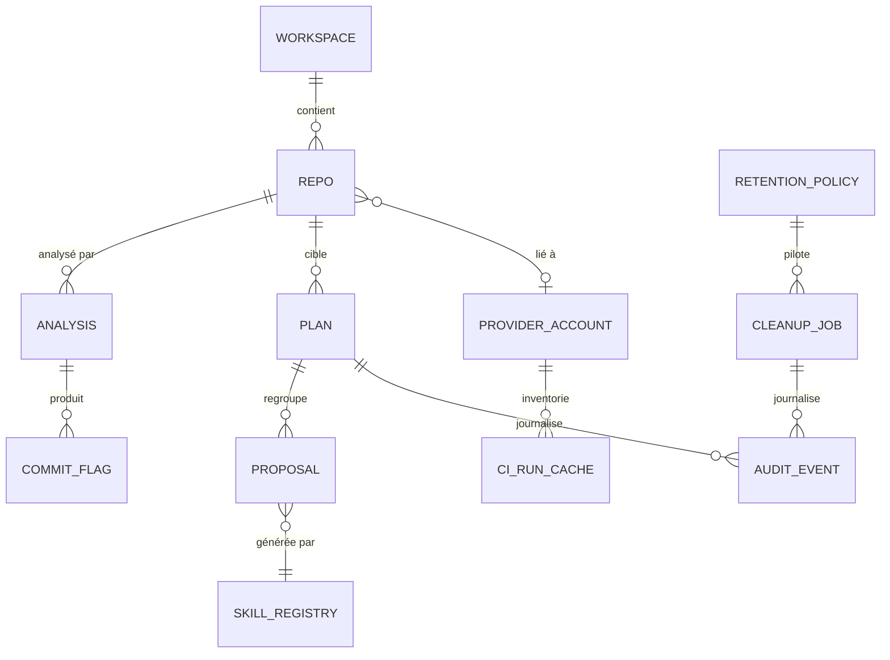

# 6. Modèle de données local

Statut : **[Recommandé]** — proposition de conception, à valider en phase de cadrage technique.

## 6.1 Principes

1. **Stockage local uniquement** : un fichier SQLite par poste (`%APPDATA%/mister-commitia/db.sqlite` sous Windows, `~/.local/share/mister-commitia/` sous Linux, `~/Library/Application Support/mister-commitia/` sous macOS). Aucune télémétrie, aucun cloud imposé.
2. **Zéro secret en base** : la base ne contient que des *alias* (`token_ref`) pointant vers une entrée du coffre du système d'exploitation (voir [07-securite-tokens.md](07-securite-tokens.md)). Un test automatisé vérifie qu'aucune colonne ne contient de matière secrète.
3. **Le dépôt Git reste la source de vérité** : la base est un cache d'analyse + un registre de plans/journaux. Elle peut être reconstruite (sauf journal d'audit et plans) par ré-analyse.
4. **Journal d'audit append-only** : les événements ne sont jamais modifiés ni supprimés par l'application (rotation par archivage uniquement).
5. **Plans immuables après application** : un plan appliqué ne change plus ; toute reprise crée un nouveau plan lié à l'ancien.

## 6.2 Schéma entité-relation



## 6.3 Tables

### `repo`
| Colonne | Type | Description |
|---|---|---|
| `id` | TEXT (ulid) | Identifiant |
| `name` | TEXT | Nom d'affichage |
| `local_path` | TEXT | Chemin local (nullable si dépôt distant déclaré non cloné) |
| `remote_url` | TEXT | URL du remote principal |
| `provider_account_id` | TEXT FK | Compte plateforme associé (nullable, mode offline) |
| `default_branch` | TEXT | Branche par défaut détectée |
| `protected_branches` | TEXT (JSON) | Branches protégées : déclarées localement **et** synchronisées depuis la plateforme |
| `governance` | TEXT (JSON) | Règles du dépôt : `protected_trailers` (ex. `Signed-off-by`), `ai_attribution_policy` (`keep-required` \| `normalization-allowed`), convention de messages cible, périmètre de réécriture autorisé |
| `added_at` / `last_scanned_at` | TEXT (ISO) | Horodatages |

### `provider_account`
| Colonne | Type | Description |
|---|---|---|
| `id` | TEXT | Identifiant |
| `kind` | TEXT | `github` \| `github_enterprise` \| `azure_devops` \| `azure_devops_server` |
| `base_url` | TEXT | URL de base (ex. `https://ghe.example.com/api/v3`, `https://dev.azure.com/{org}`) |
| `org` / `project` | TEXT | Organisation / projet (AzDO) |
| `token_ref` | TEXT | **Alias** d'entrée du coffre OS — jamais le token |
| `scopes_declared` | TEXT (JSON) | Scopes annoncés à l'enregistrement (affichés à l'utilisateur) |
| `expires_at` | TEXT | Expiration déclarée du token (métadonnée non secrète) → alerte de rotation |
| `last_validated_at` | TEXT | Dernière validation réussie (`GET /user` ou équivalent) |

Résolution hiérarchique des comptes : **dépôt → projet → organisation → défaut** (un token distinct possible à chaque niveau).

### `analysis` et `commit_flag`
- `analysis` : `id`, `repo_id`, `head_sha`, `started_at`, `finished_at`, `stats` (JSON : nb commits, auteurs, distribution des tailles de diff, taux de conformité convention, nb signatures IA détectées).
- `commit_flag` : `analysis_id`, `sha`, `kind` (`weak_message` \| `non_conventional` \| `ai_signature` \| `oversized_diff_no_body` \| `duplicate_message` \| `generated_pattern`), `score` (0-100), `details` (JSON : motif détecté, extrait).

Les commits eux-mêmes ne sont **pas** dupliqués en base (lecture à la demande via le moteur Git) ; seuls les indicateurs calculés sont persistés.

### `plan`
| Colonne | Type | Description |
|---|---|---|
| `id` | TEXT | Identifiant |
| `repo_id` | TEXT FK | Dépôt cible |
| `status` | TEXT | `draft` → `dry_run_ok` → `applied` \| `rolled_back` \| `invalidated` |
| `fingerprint` | TEXT (JSON) | Empreinte de l'état du dépôt à la création (branche, SHA du sommet, base) — l'application est **refusée** si l'empreinte ne correspond plus |
| `operations` | TEXT (JSON) | Liste ordonnée d'opérations (voir 6.4) |
| `backup_ref` | TEXT | Réf de sauvegarde créée avant application (`refs/mc/backup/...`) |
| `mapping` | TEXT (JSON) | Correspondance `ancien SHA → nouveau SHA` après application |
| `dry_run_at` / `applied_at` | TEXT | Horodatages |
| `parent_plan_id` | TEXT | Chaînage en cas de reprise |

### `proposal`
Propositions IA individuelles : `id`, `plan_id` (nullable tant que non intégrée à un plan), `skill_name`, `skill_version`, `target_shas` (JSON), `before`, `after`, `explanation` (obligatoire), `risk` (`low`|`medium`|`high`), `status` (`proposed`|`accepted`|`edited`|`rejected`), `decided_by`, `decided_at`. Une proposition **n'est jamais appliquée directement** : elle est convertie en opération de plan après décision humaine.

### `ci_run_cache`
Inventaire des exécutions CI/CD : `provider_account_id`, `repo_or_project`, `pipeline_or_workflow_id`, `pipeline_name`, `run_id`, `status`, `result`, `created_at_remote`, `url`, `retained_by_lease` (booléen, Azure DevOps), `last_synced_at`. Cache rafraîchi à la demande, avec pagination et respect des limites d'API.

### `retention_policy` et `cleanup_job`
- `retention_policy` : `id`, `name`, `scope` (JSON : comptes/projets/pipelines ciblés), `rules` (JSON : âge max par statut, nombre à conserver par pipeline, protéger les runs de release/tags, protéger les runs sous lease, protéger les N derniers succès), `enabled`.
- `cleanup_job` : `id`, `policy_id`, `mode` (`simulation` \| `execution`), `report` (JSON : liste des runs candidats, retenus et motifs, erreurs), `status`, horodatages. **Une exécution réelle exige un job de simulation préalable réussi portant sur le même périmètre.**

### `audit_event`
`id`, `ts`, `actor` (utilisateur OS), `category` (`git_rewrite` \| `ci_cleanup` \| `secret` \| `skill` \| `config`), `action`, `target`, `params_redacted` (JSON, secrets masqués), `result` (`ok`|`error`|`refused`), `plan_id`/`cleanup_job_id` (nullable). Append-only, exportable (JSONL).

### `skill_registry`
`name`, `version` (semver), `owner`, `status` (`draft`|`review`|`published`|`deprecated`), `scope` (JSON), `path` (fichier YAML sur disque, versionnable dans un dépôt Git), `content_hash` (intégrité), `imported_at`, `origin` (`builtin`|`local`|`imported`).

### `setting`
Paires clé/valeur JSON : configuration des fournisseurs IA (URL d'endpoint, modèle, timeout — la clé d'API est un `token_ref` vers le coffre), préférences UI, langue.

## 6.4 Format de plan de réécriture (`plan.json`)

Le plan est **le** livrable pivot : reproductible, exportable, diffable, versionnable.

```json
{
  "version": 1,
  "plan_id": "pln_01J4X9M2K7",
  "created_with": "mister-commitia 0.1.0",
  "repo": {
    "name": "webapp-checkout",
    "remote_url": "git@ghe.example.com:shop/webapp-checkout.git",
    "fingerprint": {
      "branch": "feature/express-payment",
      "tip": "a1b2c3d4e5f6a7b8c9d0e1f2a3b4c5d6e7f8a9b0",
      "merge_base": "main@4f5e6d7c8b9a0f1e2d3c4b5a6f7e8d9c0b1a2f3e"
    }
  },
  "preconditions": {
    "require_dry_run": true,
    "require_backup": true,
    "forbid_protected_branches": true,
    "protected_trailers": ["Signed-off-by"]
  },
  "operations": [
    {
      "seq": 1,
      "op": "reword",
      "target": "a1b2c3d4",
      "new_message": "feat(checkout): add express payment flow\n\nRefs: SHOP-1234",
      "origin": "skill:conventional-commits@1.2.0",
      "risk": "low",
      "approved_by": "guillaume",
      "approved_at": "2026-07-24T09:12:00Z"
    },
    {
      "seq": 2,
      "op": "squash",
      "targets": ["b2c3d4e5", "c3d4e5f6", "d4e5f6a7"],
      "new_message": "fix(cart): stabilize quantity rounding",
      "origin": "skill:commit-synthesis@1.0.0",
      "risk": "medium",
      "approved_by": "guillaume",
      "approved_at": "2026-07-24T09:14:30Z"
    },
    {
      "seq": 3,
      "op": "drop",
      "target": "e5f6a7b8",
      "reason": "commit vide résiduel",
      "risk": "high",
      "approved_by": "guillaume",
      "approved_at": "2026-07-24T09:15:10Z"
    }
  ],
  "result": {
    "status": "dry_run_ok",
    "preview_ref": "refs/mc/preview/pln_01J4X9M2K7",
    "backup_ref": null,
    "mapping": []
  }
}
```

Opérations supportées : `reword`, `squash`, `fixup`, `reorder`, `drop`, `edit_trailers` (ajout/suppression contrôlée de trailers, soumise à `protected_trailers`).

## 6.5 Espaces de réfs Git utilisés

| Espace | Usage | Cycle de vie |
|---|---|---|
| `refs/mc/preview/<plan_id>` | Résultat **réel** du dry-run (historique réécrit dans une réf détachée, la branche n'est pas touchée) | Supprimé à l'invalidation du plan |
| `refs/mc/backup/<branche>/<horodatage>` | Sauvegarde avant application | Conservé ; purge manuelle uniquement |
| Tag `mc-backup/<plan_id>` | Point de restauration nommé | Idem |

Ce mécanisme permet un aperçu avant/après exact (le dry-run **construit réellement** le nouvel historique, hors branche), un rollback trivial (`reset` de la branche sur la réf de backup) et ne pollue pas `refs/heads`.

## 6.6 Invariants vérifiés par tests

1. Aucun secret en base (scan du fichier SQLite après scénarios E2E).
2. `plan.status = applied` ⇒ `backup_ref` non nul et existant dans le dépôt.
3. Un plan `applied` n'est plus jamais modifié (trigger applicatif).
4. Toute ligne `cleanup_job.mode = execution` référence une simulation antérieure réussie.
5. `audit_event` est strictement croissant et sans trous (séquence).
